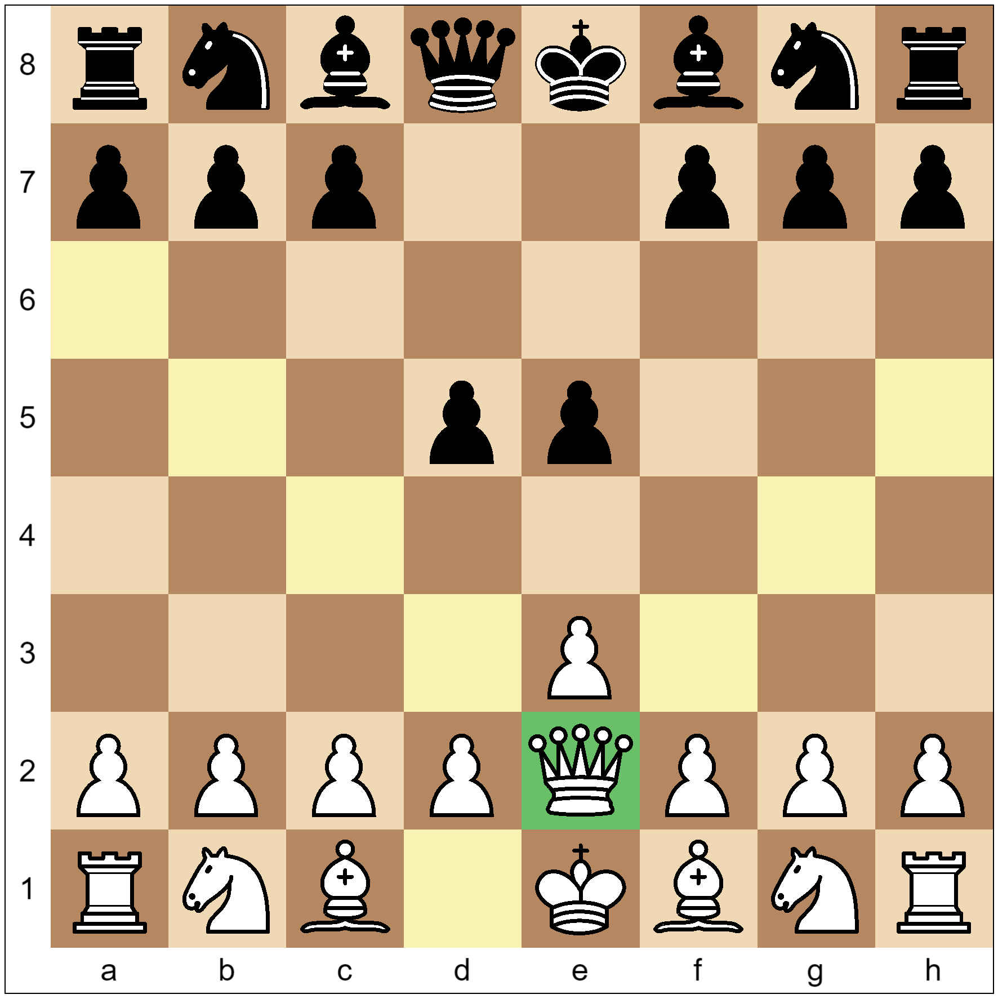

# StageXL Interactive Chessboard

An interactive chessboard written for StageXL which allows players to move pieces.



## Example
```dart
Chessboard board = Chessboard();
stage.addChild(board);
```

## It is fully compatible with chess.dart
```dart
Chess.Chess chess = Chess.Chess()
  ..move("e3")
  ..move("e5")
  ..move("Qe2")
  ..move("d5");
board.loadFromChessObject(chess);
```

## Any square can have its background color set
```dart
board.resetAllSquareColors();
board.setSquareBackgroundColor("e1", 0xaa27b243);
```

## Capture when squares are clicked
```dart
board.onSquareClicked.listen((ChessEvent event) {
  print(event.squareName);
});
```

## Show and hide the labels around the board
```dart
board.showLabels = true;
```

## Change which way round the board is
```dart
board.blackAtTop = false;
```
